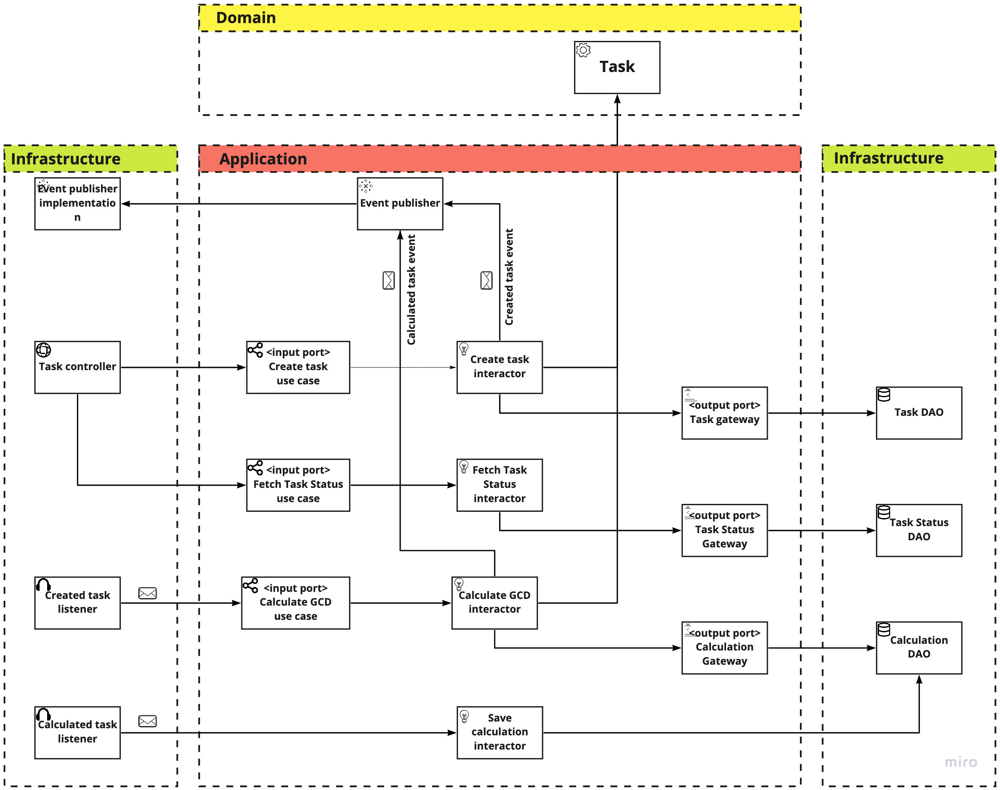

# gcd-ca

## About
`gcd-ca` is sample app using Clean Architecture way

## Structure of app


## Getting started
1. Install docker - [doc](https://docs.docker.com/get-docker/)
2. Clone or download project
3. Navigate to `gcd-ca` directory
4. run `docker-compose up -d --build`

## Usage
### Create task
#### Description
Create task to calculate GCD
#### Request:
`POST http://{app_host}/api/v1/task?n1={param_1}&n2={param_2}`
#### Params
1. `param_1` - The first integer param
2. `param_2` - The second integer param
#### Response
Return identifier of created task in UUID format

### Get status of task
#### Description
Get status of task
#### Request:
`GET http://{app_host}/api/v1/task/{task_identifier}`
#### Path variable
1. `task_identifier` - Task identifier in UUID format
#### Response
Response format: application/xml
Response body:
```json
{
    "identifier": "e4e2763c-5ffe-4839-ae9c-d031dea4a278",
    "status": "DONE",
    "n1": 195,
    "n2": 45,
    "result": 15
}
```

## Licence 
This project is licensed with the [MIT license](https://github.com/conacry/gcd-ca/blob/main/LICENSE).